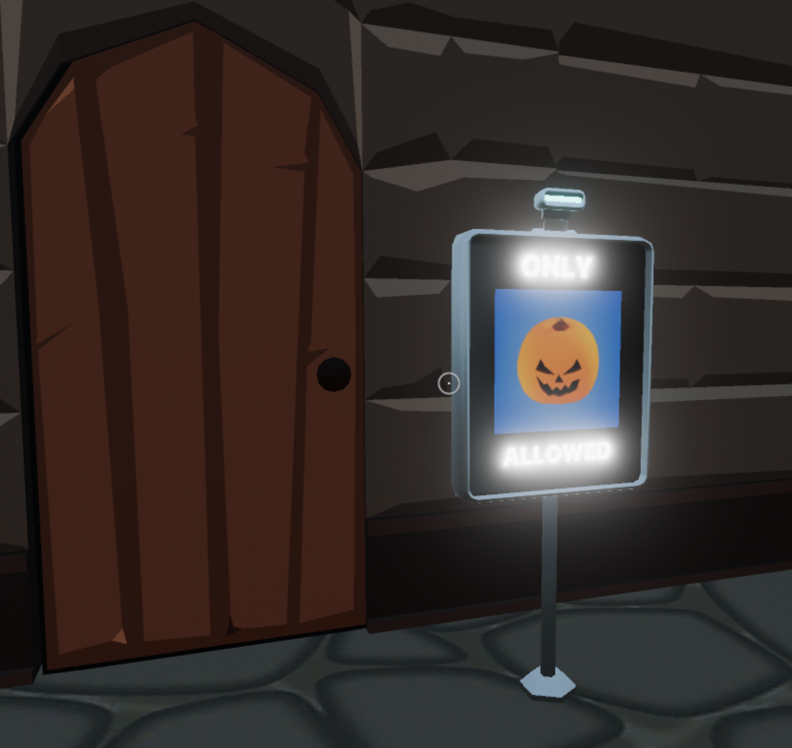

# wearables-scanner

A simple scene that shows how to fetch player wearable data to match against a criteria. In this case, only players wearing eyewear are allowed in.

The crypto Utils function makes it a lot simpler to perform blockchain functions. Here we're querying the player's wearable items that are being equipped, and also fetching the full list of Decentraland wearables. We then match both these lists up to obtain more information about each of the wearables that the player has equipped, and check if any of these belongs to the 'eyewear' category.

You could similarly do different queries, like check for a specific wearable item by name, or check for any item of 'mythic' rarity.

Feel free to reuse the models and code from this scene!
